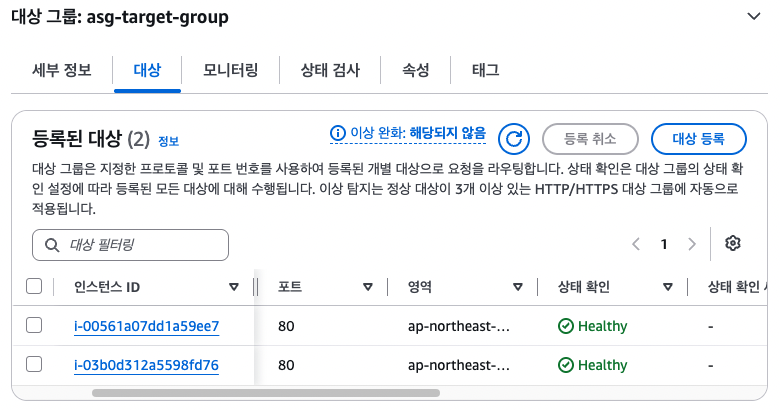

# Auto scaling

## 하는일
로드 밸런서는 트래픽을 분산시켜주긴 하지만.. 부하에 따라서 서버를 늘려주거나 감소시켜주지 못함.
그래서 등장한 것이 오토 스케일링!
1. scale out : 서버 증가
2. scale in : 서버 감소

## Launch Template
서버를 증가시킬 때 어떤 기준으로다가 서버를 만들지???에 대한 것.
즉, ec2 생성 설계도?설명서? 같은것.


## 바로 실습!
```bash
# 실습할 구조
  Internet
      │
     ALB
      │
 web-asg-tg
      │
Auto Scaling Group
      │
 ┌────┴────┐
 │         │
EC2-1   EC2-2
```

### 1. Launch Template 만들기 
user data 없이 생성할 경우, health check에서 http 80으로 계속 호출할텐데 nginx가 없어서 응답을 못하면 서버가 없다고 판단해서 asg가 계속 서버를 만들 수 있음.
```bash
# ec2 생성에 필요한 정보들은 모아둔것
os : Ubuntu
type : t3.micro
sg : Web SG
user data : 
#!/bin/bash
apt update -y
apt install nginx -y
echo "<h1>Hello Auto Scaling</h1>" > /var/www/html/index.html
systemctl enable nginx
systemctl start nginx
...
```

### 2. asg용 target group 생성하기
instance 아무것도 추가하지 말고 생성하기.
asg를 생성하면 기존의 서버를 인식하는게 아니라 asg 생성 기점으로 서버를 기준에 맞춰서 새로 만들어줌.
그래서 새로 생성할 서버를 담아줄 asg전용 target group 생성해서 붙여주기.
! 이  target group을 alb에 연결해줘야지 unused가 안되고, alb에서도 해당 서버로 트래픽을 보낼 수 있음.

### 3. asg 생성하기
application recovery controller(ARC) : 더 높은 단계의 고가용성을 위한 기능
- 리전 하나가 망가졌을때 그 리전을 사용하지 않고 정상적인 리전만 사용하게 해주는 기능
- 금융권, 게임, 항공사.. 절대로 서비스가 멈추면 안되는 곳에서 사용 
- 당연히 추가비용 있고, 단순 스위치가 아니라 route53, health check, multi-region, failover 전략 등이 같이 설계되어야 함.
- 고가용성 1단계 : multi region + ALB + ASG
    -> 이정도로도 대부분의 서비스가 요구하는 고가용성을 만족함.
- 고가용성 2단게 : route53 failover + ARC + multi region

```bash
# asg 옵션
1. template : 기생선한 런치 템플릿 선택
2. vpc : 기생성한 vpc
3. az, subent : ec2개 생성될 private subnet
4. 추가 용량 설정 : 없음
     -> 이거는 내가 생성하려고 하는 인스턴스 타입이 aws내에서 부족하면 생성이 실패하기 때문에 미리 50대, 100대 용량을 예약해두는것.
5. vpc lattice 통합 옵션 : 없음
     -> lattice는 vpc안의 여러 서비스를 연결하는 기능. msa 환경에서 서비스끼리 쉽게 통신하게 해줌.
6. application recovery controller(ARC) : 비활성화
7. ELB 상태 확인 : 켜기
    -> ALB가 판단한 결과를 ASG도 믿겠다는 옵션
8. EBS 상태 확인 : 켜기
9. 상태 확인 유예 기간 : 120초
    -> 서버가 생성되는 중에 alb가 상태 체크하는 유예 기간
    -> user date가 많으면 300초로 하는 경우도 많음
10. 그룹 크기 : Desired = 2, Minimum = 2, Maximum = 4
11. udomatic scaling : 없음
12. 인스턴스 유지 관리 정책 : 종료 전 시작
13. 인스턴스 축소 보호 : 비활성화
   -> 서버 대수를 줄일 때 특정 ec2는 삭제 못하게 보호하는 기능. 특정 서버에서 대용량 배치 작업 중일때 등등..
14. cloudwatch 그룹 지표 수집 : 활상화
15. 기본 인스턴스 워밍업 : 활성화, 120초
   -> 서버가 생성될 때 해당 시간 만큼은 cloudwatch에서 무시
16. asg 그룹 삭제 보호 : 없음(기본값)
17. 배치 그룹 : 없음
   -> ec2를 최대한 가까운 서버에 둘지, 다른 랙에 둘지 결정. HPC, AI, 고성능 연산... 뭐 이런 곳에서 씀. 웹은 안씀 
18. 알림 추가 : 없음
...
```

### 4. asg 테스트
서버 1개 삭제 후 새로 서버 1개 생성되는지 확인하고, 새로운 서버에 user data에 적힌 nginx가 잘 생성되었는지 확인
asg target group 대상에서 신규로 생성된 인스턴스가 healthy로 되어있는지 확인

<p align="left">
  
</p>