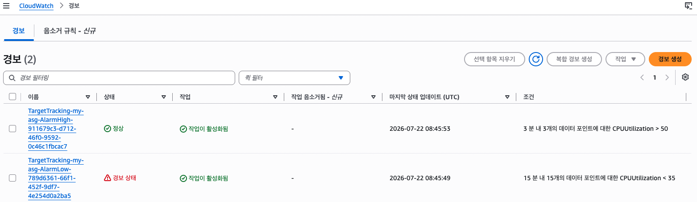
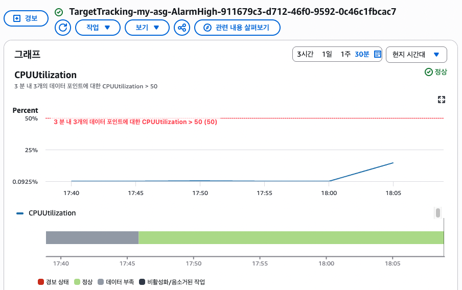
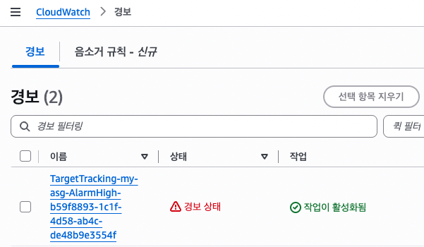
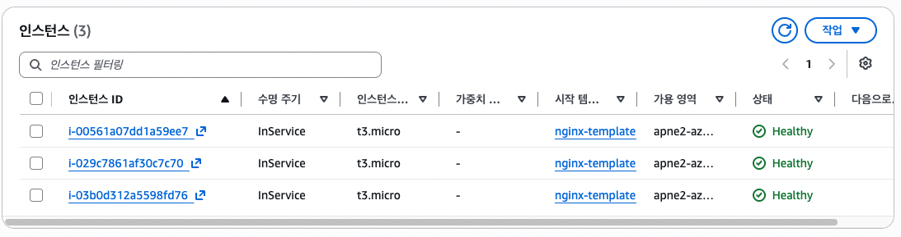
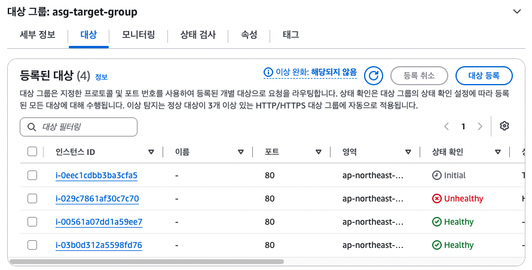

# Auto scaling

## Scale in, out
부하가 증가되면 서버가 늘어나고 감소하면 서버가 감소하는 기능.
```bash
EC2 CPU 증가
    ↓
CloudWatch가 감지
    ↓
Alarm 발생
    ↓
ASG Scaling Policy 실행
    ↓
EC2 1대 추가 생성
    ↓
Target Group 등록
    ↓
Healthy
    ↓
ALB가 트래픽 분산
```

## 실습!

### 1. scaling policy 생성
앞에서 생성한 ASG -> Automatic scaling -> 동적 크기 조정 정책 생성
```bash
정책 유형 : 대상 추적 크기 조정(Target tracking scaling policy)
정책 : 평균 CPU 사용률을(를) 50(으)로 유지하는 데 필요한 경우
워밍업 : 300초
```

### 2. cloudWatch에 alarm 생성 확인
asg에 scaling policy를 생성하면 cloudwatch에 자동으로 알람이 2개 생김
1. cpu 높을 때 알람
2. cpu 낮을 때 알람
<p align="left">
  
</p>

### 3. cpu 수동으로 올려보기
- yes : "y"를 출력하는 명령어. 끝없이 출력함
- /dev/null : 리눅스의 쓰레기통 같은 파일
   -> 여기로 보낸 데이터는 전부 버려짐
```bash
# 1. 간단하게 cpu 부하 올리기
# yes가 y를 계속 생성하는데 /dev/null이 게속 버리는데 이 작업 무한 반복 -> cpu가 쉬지 않고 일함
yes > /dev/null
```
- stress : 부하테스트용 프로그램
- cpu worker 생성, 종료시간 계산 등 다양하게 설정 가능
```bash
# 2. stress 다운 받아서 실행하기
sudo apt install stress -y

stress --cpu 4 --timeout 300
```

| yes > /dev/null | stress              |
| --------------- | ------------------- |
| CPU 하나 사용       | 원하는 개수의 CPU 사용 가능   |
| 직접 여러 개 실행해야 함  | `--cpu 4` 한 줄이면 끝   |
| 종료를 직접 해야 함     | `--timeout`으로 자동 종료 |
| 단순한 무한 루프       | 부하 테스트용으로 만들어진 프로그램 |

<p align="left">
  
</p>

### 4. 부하 이후 상황 

1. cloudwatch 알람
설정한 기준치 이상이 되어서 클라우드와치에서 경보가 뜸
<p align="left">
  
</p>

2. asg Desired 값
ASG 생성할 때 Desired이 2였지만, CPU 부하로 3으로 증가
<p align="left">
  
</p>

1. 새로운 ec2 생성 (Scale in)
ASG Scaling Policy 실행되서 새로운 서버가 생성
<p align="left">
  
</p>

1. target group에 등록
ASG target group에 등록되었는지 확인
<p align="left">
  
</p>